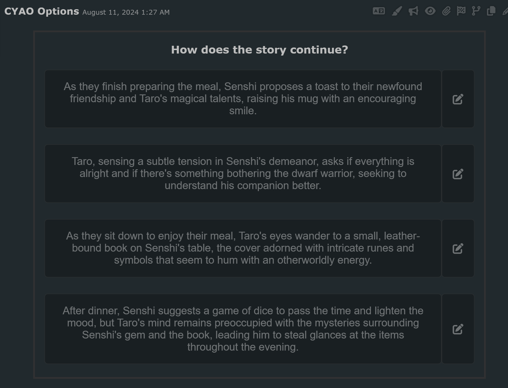
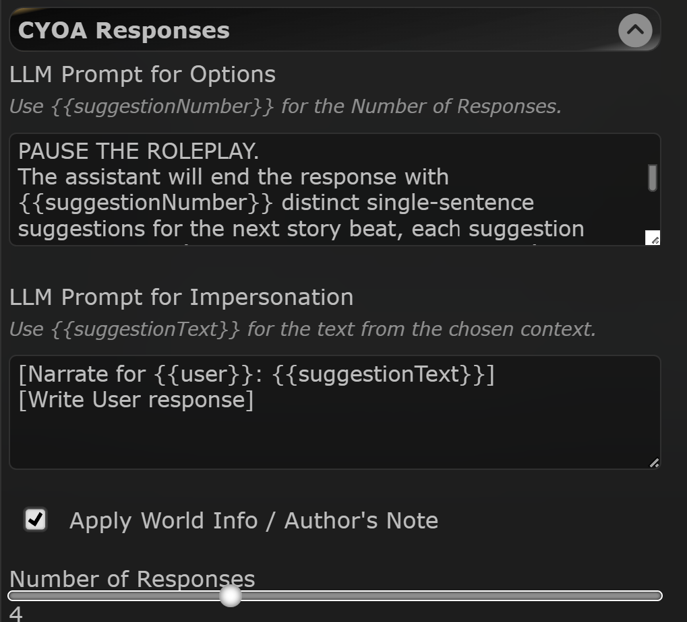

# SillyTavern CYOA Responses Extension
This extension adds Choose Your Own Adventure (CYOA) style responses to your SillyTavern chats. It generates multiple response options for the user to choose from, enhancing interactivity and allowing for branching narratives.

<p align="center">
  
</p>

## Features
- Generates multiple response options for user selection
- Customizable number of response options
- Impersonation of selected responses
- Slash command integration for quick access
- Customizable prompts for option generation and impersonation

## Installation
Use SillyTavern's built-in extension installer with this URL:

## Usage
1. Open the extension settings in SillyTavern.
2. Configure the LLM prompts for option generation and impersonation.
3. Set the desired number of response options.
4. Use the `/cyoa` slash command in chat to generate CYOA options.

### CYOA Buttons
After generating CYOA options, you'll see a set of buttons for each suggestion:
- **Suggestion Button**: Clicking on the main suggestion button will automatically impersonate the selected option. This means the AI will act as if the user had chosen that particular story beat.
- **Edit Button**: Next to each suggestion is an edit button (pencil icon). Clicking this will copy the suggestion text to the input area, allowing you to modify it before sending or use it as inspiration for your own response.

### Settings
<p align="center">
    
</p>

- **LLM Prompt for Options**: Customize the prompt used to generate CYOA response options. You can use `{{suggestionNumber}}` as a placeholder for the number of responses.
- You must ensure the LLM response contains each suggestion between `<suggestion></suggestion>` tags. The plugin also support `< suggestion >` and `Suggestion N: text...` as valid tags.
- **LLM Prompt for Impersonation**: Set the prompt used when impersonating the selected response. Use `{{suggestionText}}` as a placeholder for the chosen option's text.
- **Apply World Info / Author's Note**: Toggle to include World Info and Author's Note in the CYOA generation process.
- **Number of Responses**: Adjust the slider to set how many CYOA options are generated (1-10).

### LLM Prompt Examples:
```
PAUSE THE ROLEPLAY.
The assistant will end the response with {{suggestionNumber}} distinct single-sentence suggestions for the next story beat, each suggestion surrounded by `<suggestion>` tags:
<suggestion>suggestion_1</suggestion>
<suggestion>suggestion_2</suggestion>
... 
```

### Impersonate Prompt Example:
```
[Narrate for {{user}}: {{suggestionText}}]
[Write the User response]
```

## Slash Command
The extension exposes the `/cyoa` slash command, which can be added to SillyTavern's QuickSettings for easy access. This command triggers the generation of CYOA response options.

## Prerequisites
- SillyTavern version 1.12.4 or higher

## Support and Contributions
For support or questions, use the github issues or join the SillyTavern discord server.

Contributions to improve this extension are welcome. Please submit pull requests or issues on the GitHub repository.

## Credits
This extension was inspired by the work of LenAnderson. Original idea: https://gist.github.com/LenAnderson/7686604c9da30dee21b76a633a0027f4

## License
No License, feel free to use this extension for whatever you want.
